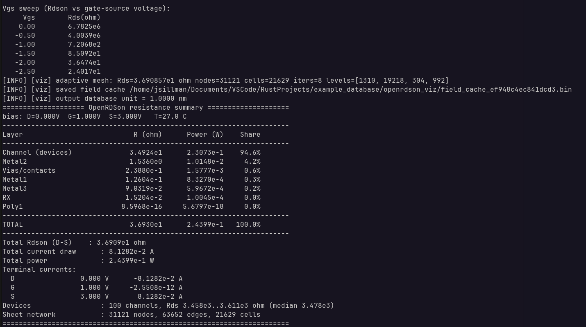
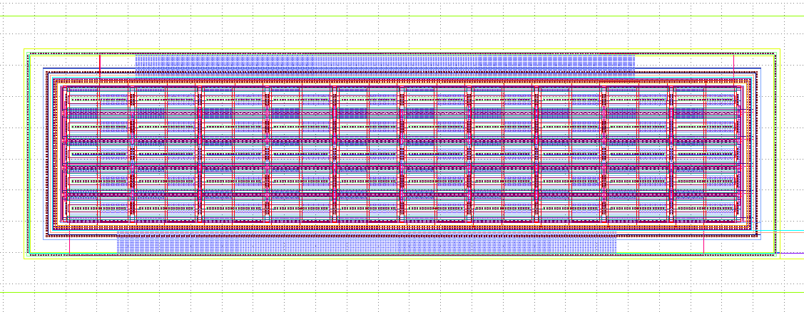
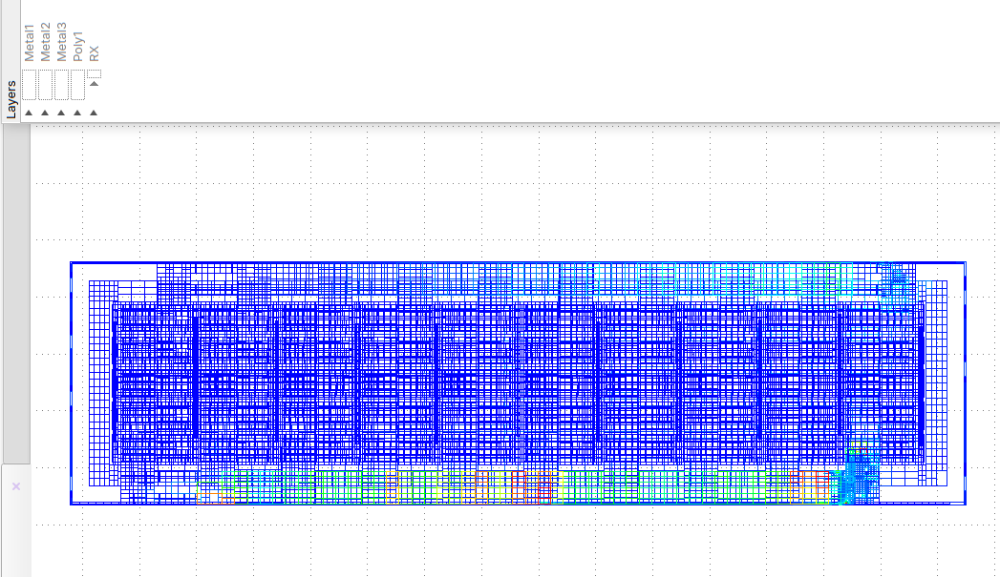
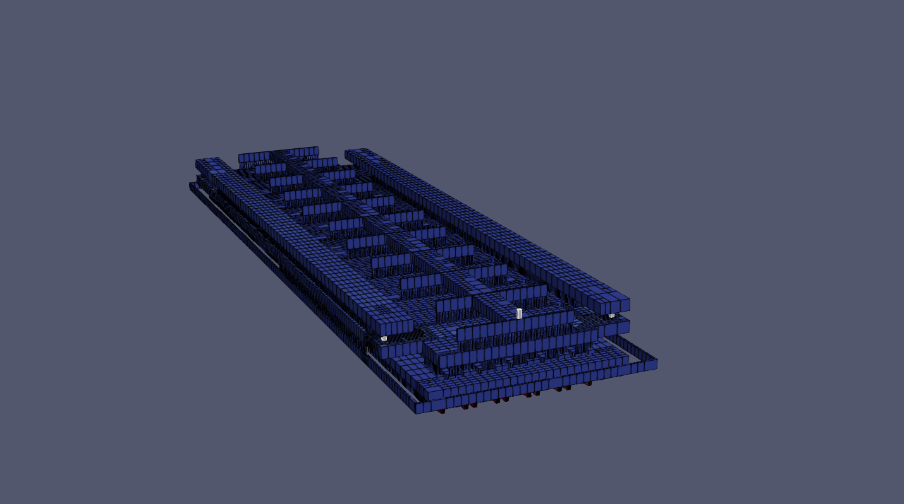

<p align="center"></p>

# OpenRdson

## Introduction
---
OpenRdson extracts the **on-resistance (Rds(on))** of power devices — multi-finger
LDMOS / power MOSFETs and similar — directly from the physical layout, the
process technology, and the golden LVS netlist.

## Background
---
This project is an open-source competitor solution to **Synopsys / Silicon Frontline's R3D** parasitic extraction tool. The accuracy and performance of this project aims to match the quality of signoff you would expect from R3D.

Rather than meshing the whole die in 3D (infeasible at process scale), OpenRdson
builds a **2.5D sheet-resistance network**: each conducting layer becomes a 2D
resistor mesh, vias/contacts become lumped resistors, and each device becomes a
bias-dependent channel resistor. The network is solved across the full die and
the resulting drain–source resistance — plus a per-layer breakdown — is
reported. A device-local 3D FEM path is also available for higher-fidelity
access-resistance analysis.

---
# Gallery
Example Database of a 100-finger LDMOS FET from personal verification & development


## Stdout Report

## Original Layout (KLayout AGF)

## GDS Result Database (KLayout GDS + LYP)

## 2.5D Extruded Result Database (ParaView stack_\*.VTU)


---
## Features

- **Full-die 2.5D sheet extraction** — scales to the whole die where 3D FEM cannot.
- **Device recognition** — matches layout devices to the golden schematic netlist
  (template-driven, orientation-aware).
- **Bias-dependent channel model** — tabulated `Id(T, Vgs, Vds)` lookup, plus
  optional ngspice co-simulation if using BSIM device models.
- **Adaptive quadtree meshing** — error-indicator-driven refine→solve loop, with
  warm-started linear and local-bias solves.
- **Finite-volume weighting** — node-centred control volumes for accurate sheet
  resistance (analytic bar exact).
- **Footprint-aware vias** — vias/contacts inject current over their drawn
  footprint rather than a single node.
- **Field cache** — the solved field is persisted to disk so re-exporting the
  visualization (or keeping multiple accuracy levels) does not re-solve.
- **Visualization** — KLayout GDS colormaps and ParaView VTU output (potential,
  current density, power, current, resistance, per-layer stacks).
- **Netlist export** — SPICE and SPEF.
- **Clear, section-tagged logging** with a CCI import summary (devices, nets,
  W/L).

## Commands

| command       | description |
|---------------|-------------|
| `sheet-rds`   | Full-array 2.5D sheet extraction; prints the Rds(Vgs) table |
| `viz`         | Export the solved field to KLayout / ParaView (cached; re-solves only when stale) |
| `device-rds`  | Device-local 3D FEM extraction |
| `mode-a`      | Mode-A (access-resistance) extraction |
| `netlist`     | SPICE / SPEF export |
| `all`         | Solve Rdson, print the table, and export the visualization |

Run `openrdson --help` for the full flag list.

---
## Installation

```sh
git clone <REPOSITORY_URL>        # placeholder — replace with the real URL
cd openrdson
cargo build --release
```

The binary is `target/release/openrdson`.

### Optional features

```sh
cargo build --release --features faer-sheet
```

`faer-sheet` uses [faer](https://github.com/sarah-ek/faer-rs)'s sparse Cholesky
for the 2D sheet solves (faster on very large networks). The default build uses
the bundled IC(0)-preconditioned conjugate-gradient solver and has **no external
solver dependency**.

## Dependencies

- **Rust (2024+)** and a recent Cargo toolchain.
- **faer** — optional, sparse direct solver (`faer-sheet` feature).
- **ngspice** — optional, an external `ngspice` binary used only for Mode A
  channel co-simulation.

Everything else — YAML config, logging, the linear solver, and the VTU/GDS
writers — is implemented in-tree.

---
## Usage

1. Write a config file. Start from the template and fill in your database paths:

   ```sh
   openrdson --print-default-config > openrdson.yaml
   ```

2. Run a command:

   ```sh
   openrdson --config openrdson.yaml sheet-rds   # Rds(Vgs) table
   openrdson --config openrdson.yaml viz         # KLayout + ParaView output
   openrdson --config openrdson.yaml all         # solve + table + export
   ```

### Required inputs

**Note**: It is recommended that the user utilizes the CCI (Calibre Connectivity Interface) Query Server. If you are part of an educational institution or company using a Cadence Virtuoso layout flow, you may know this as an extraction result from "Quantus QRC" / "Pre-RC" layout verification. The user should extract their layout using CCI from a *clean* LVS run.

* CCI (Calibre Connectivity Interface) Database Files:
	- **Layout** — AGF or GDSII, plus a GDS layer→name map. (`.agf` & `.gds.map`)
	- **Ports** — terminal/port definitions (name, net, position). (`.ports` & `.pin_xy_spi`)
	- **Device templates** (`devtab`) and the **golden LVS SPI netlist**. (`.devtab`)
	- **Process stack** — an ICT technology file, plus the CCI logical→physical
	  layer map. (`.ict` & `.map`)
		- This mapfile may exist in your institution's PDK database or it may need to be manually created. If unfamiliar, please review the mapfile syntax from R3D or Silicon Frontline.
- **Channel model table** (CSV) — required only when active devices are present.
	- This table should be a full-factorial table in the format as shown below (mirroring R3D's table model format):
```csv
Temperature 25
Vgsmax 0
L 4.0e-7
Wfinger 1.0e-6
Model MY_NMOS
axis names: temperature,Vgs,Vds,Id
27.0,0.0,0.0,0.0
27.0,0.0,0.1,5.5e-14
...
```
 
## Recommended use cases

- On-resistance (Rds(on)) extraction and Rds-vs-Vgs characterization of power
  devices.
- Metal / via / channel resistance contribution breakdown (which layer dominates
  the loss).
- Current-density and power-density visualization across the full die.
- Verification that a layout's device population matches the golden schematic
  netlist.
- Access-resistance (Mode A) analysis of a single device.

## Hardware recommendations

- **CPU** — any modern 64-bit CPU. The current solver is single-threaded, so
  clock speed matters more than core count.
- **Memory** — scales with the mesh (nodes and edges). A small example sits at a
  few tens of MB; budget several GB for large dies or fine cell sizes.
- **Storage** — negligible beyond the tool itself; the visualization output
  (GDS + VTU) and the field cache are the only artifacts.

---
# Troubleshooting and Process Privacy
There are many debugging options built into the logging of the script, but the repository has only been tested on a handful of layouts from a single company's PDK. Improving the performance and adaptability of this project will be a community effort. If you run into bugs that are not clear or easy to solve, please reach out through a Github issue or personal contact.

**Note**: Exposing sensitive PDK information is not necessary when filing an issue for Open Rdson. General information about the bug may suffice, but hotfix versions may be distributed to the reporter of the issue to confirm fixes. It is recommended that the user go through their own debugging steps with an AI agent first to ingest the codebase and shorten the latency for debugging efforts. If a genuine bug is found, please report it to the issues page.

---
# Planned Improvements

Below are some planned improvements to make the project more polished and optimized

* User choice between quad-meshes and tri-meshes
* Thermal-extraction co-simulation: First-pass power extraction -> Import power field into thermal solver -> Import back into power extraction -> Iterate until below error threshold
* Better ngspice support
* Subfinger splitting: Split large-W fingers into effective "subdevices" for better table model accuracy
* Comprehensive QRC-Like SPICE export: Resistor mesh export with spice or Spectre support
* Readthedocs: Better documentation of all classes and functions.

Please submit more ideas!


---
## License

Licensed under MIT license.

## Repository layout

| path | purpose |
|------|---------|
| `orchestration` | CLI driver and visualization export |
| `extraction` | 2.5D sheet-resistance network + adaptive meshing |
| `validation` | sheet/device extraction orchestration and field cache |
| `channel` | channel model (lookup table + ngspice) |
| `device-recognition` | layout→schematic device recognition |
| `device-recognition-verify` | recognition verification against the golden netlist |
| `layout-db` | layout ingestion and connectivity extraction |
| `techfile` | ICT process-stack parsing |
| `geometry` | 3D solid stack assembly |
| `meshing` | hexahedral mesh generation |
| `solver` | sparse solvers (IC(0)-PCG, optional faer Cholesky) |
| `netlist` | SPICE / SPEF writers |
| `config` | YAML configuration |
| `openrdson-core` | shared geometry / device IR and logging |
| `openrdson-io` | GDSII / VTU writers |
